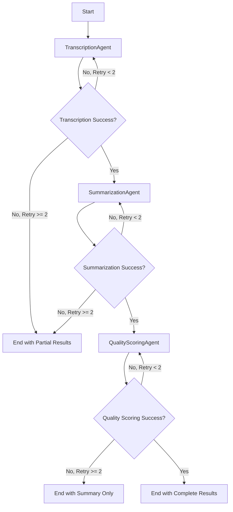

# System Architecture

This document provides a detailed technical overview of the AI Call Center Assistant's multi-agent architecture, workflow design, and system components.

For data models and API schemas, see **[API Documentation](API.md)**.

## High-Level Architecture

```
┌─────────────────┐    ┌──────────────────┐    ┌─────────────────┐
│   Input Layer   │    │  Processing Layer │    │  Output Layer   │
├─────────────────┤    ├──────────────────┤    ├─────────────────┤
│ • Audio Files   │───▶│   LangGraph      │───▶│ • Structured    │
│ • Text Files    │    │   Workflow       │    │   Results       │
│ • Streamlit UI  │    │                  │    │ • Error Reports │
│ • CLI Interface │    │ ┌──────────────┐ │    │ • JSON Output   │
└─────────────────┘    │ │ Multi-Agent  │ │    │ • UI Display    │
                       │ │ Orchestration│ │    └─────────────────┘
                       │ └──────────────┘ │
                       └──────────────────┘
```

## Multi-Agent System

### Agent Hierarchy

```
BaseAgent (Abstract)
├── TranscriptionAgent
├── SummarizationAgent
└── QualityScoringAgent
```

### Agent Communication Flow



## LangGraph Workflow Implementation

### State Management

The workflow uses a centralized `AgentState` object that flows through all agents:

```python
class AgentState(BaseModel):
    call_id: str                           # Unique identifier
    input_data: CallInput                  # Original input
    transcript_text: Optional[str]         # Text from transcription
    speakers: List[SpeakerSegment]         # Speaker diarization data
    summary: Optional[CallSummary]         # Summary from summarization agent
    quality_score: Optional[QualityScore]  # Scores from quality agent
    errors: List[Dict[str, Any]]           # Error accumulation
    retry_counts: Dict[str, int]           # Per-agent retry tracking
```

### Workflow Graph Structure

```python
# Node definitions
graph.add_node("transcription", self._run_transcription)
graph.add_node("summarization", self._run_summarization)  
graph.add_node("quality_scoring", self._run_quality_scoring)

# Entry point
graph.set_entry_point("transcription")

# Conditional routing with retry logic
graph.add_conditional_edges("transcription", self._route_after_transcription, {
    "retry": "transcription",
    "continue": "summarization", 
    "end": END
})
```

### Routing Logic

Each agent has intelligent routing based on success/failure and retry counts:

```python
def _route_after_transcription(self, state: AgentState) -> str:
    if not state.transcript_text and state.retry_counts.get("transcription", 0) < 2:
        return "retry"
    elif state.transcript_text:
        return "continue"
    else:
        return "end"  # Failed after max retries
```

## Agent Implementations

### TranscriptionAgent

**Purpose:** Convert audio input to text with speaker identification

**Technology Stack:**
- Primary: Deepgram API (with speaker diarization)
- Fallback: OpenAI Whisper API
- Audio format support: MP3, WAV, M4A, OGG, WebM

**Processing Pipeline:**
1. Validate audio input format
2. Attempt transcription with Deepgram using utterance-level diarization
3. Extract pre-grouped speaker segments (no word-level parsing needed)
4. On failure, fallback to OpenAI Whisper
5. Return transcript text and speaker segments

**Key Features:**
- Automatic speaker identification
- High-accuracy transcription
- Multiple provider fallback
- Audio format validation

### SummarizationAgent

**Purpose:** Generate structured summaries from call transcripts

**Technology Stack:**
- LLM Provider: OpenAI GPT-4
- Framework: LangChain
- Output Validation: Pydantic models

**Processing Pipeline:**
1. Analyze transcript text and speaker data
2. Create context-aware prompts
3. Generate structured summary via LLM
4. Extract key points and sentiment
5. Determine call outcome classification

**Prompt Engineering:**
- Speaker-aware context when available
- Structured output formatting
- Domain-specific call center terminology
- Sentiment and outcome classification

### QualityScoringAgent

**Purpose:** Evaluate call quality using standardized rubrics

**Technology Stack:**
- LLM Provider: OpenAI GPT-4
- Function Calling: Structured score output
- Validation: Pydantic score constraints

**Scoring Rubrics:**

**Tone Score (1-10):**
- 1-3: Negative, hostile, or unprofessional tone
- 4-6: Neutral but may lack warmth or engagement
- 7-8: Positive, friendly, appropriate tone
- 9-10: Exceptional empathy and customer connection

**Professionalism Score (1-10):**
- 1-3: Inappropriate language, protocol violations
- 4-6: Basic professionalism with some issues
- 7-8: Professional conduct following guidelines
- 9-10: Exemplary professionalism and expertise

**Resolution Score (1-10):**
- 1-3: Issue unresolved, customer frustrated
- 4-6: Partial resolution or unclear outcome
- 7-8: Issue resolved satisfactorily
- 9-10: Excellent problem-solving with proactive help

## Error Handling & Resilience

### Retry Strategy

```python
# Per-agent retry configuration
MAX_RETRIES = 2

# Exponential backoff for API calls
RETRY_DELAYS = [1, 2, 4]  # seconds

# Graceful degradation on failures
ALLOW_PARTIAL_RESULTS = True
```

### Error Categories

1. **Transient Errors** (retryable):
   - API rate limits
   - Network timeouts
   - Temporary service unavailability

2. **Permanent Errors** (non-retryable):
   - Invalid API keys
   - Unsupported file formats
   - Malformed input data

3. **Partial Failures**:
   - Transcription succeeds but summarization fails
   - Summary succeeds but quality scoring fails

### Fallback Mechanisms

1. **Transcription Fallbacks:**
   - Deepgram → OpenAI Whisper → Manual text input

2. **Model Fallbacks:**
   - GPT-4 → GPT-3.5-turbo (configurable)

3. **Output Fallbacks:**
   - Complete results → Partial results → Error report

## Configuration Management

### Environment-Based Configuration

```python
# config/settings.py
class Settings:
    openai_api_key: Optional[str]
    deepgram_api_key: Optional[str]
    langchain_api_key: Optional[str]
    log_level: str = "INFO"
    max_retries: int = 2
    timeout_seconds: int = 30
```

### Model Configuration

```python
# Configurable model providers
SUPPORTED_PROVIDERS = {
    "openai": ["gpt-4", "gpt-3.5-turbo"],
    "anthropic": ["claude-3-sonnet", "claude-3-haiku"]
}

# Default model selection
DEFAULT_MODELS = {
    "summarization": "gpt-4",
    "quality_scoring": "gpt-4"
}
```

## Performance Characteristics

### Processing Times (Typical)

- **Audio Transcription**: 0.5-2x real-time (30s audio → 15-60s processing)
- **Text Summarization**: 5-15 seconds per call
- **Quality Scoring**: 3-8 seconds per call
- **Total Pipeline**: 20-90 seconds for 5-minute calls

### Scalability Considerations

1. **Stateless Agents**: Each agent operation is independent
2. **Parallel Processing**: Multiple calls can be processed concurrently
3. **Resource Usage**: Memory scales with transcript length
4. **API Limits**: Rate limiting based on provider constraints

## Integration Points

### External APIs

```python
# Transcription providers
DEEPGRAM_ENDPOINT = "https://api.deepgram.com/v1/listen"
OPENAI_AUDIO_ENDPOINT = "https://api.openai.com/v1/audio/transcriptions"

# LLM providers  
OPENAI_CHAT_ENDPOINT = "https://api.openai.com/v1/chat/completions"
```

### Data Storage

```python
# File system storage for samples
DATA_DIR = "data/sample_transcripts/"

# Optional memory layer (future enhancement)
REDIS_CONFIG = {
    "host": "localhost",
    "port": 6379,
    "db": 0
}
```

## Security Considerations

### API Key Management
- Environment variables for sensitive data
- No hardcoded credentials in source code
- Optional .env file for development

### Input Validation
- File type validation before processing
- Content size limits for audio files
- Sanitization of user-provided text

### Error Information
- Error messages sanitized before display
- No sensitive data in logs
- Secure handling of temporary files

## Deployment Architecture

### Docker Containerization

The application is containerized using a multi-stage Docker build for optimal image size:

```dockerfile
# Stage 1: Builder
- Install build dependencies
- Create virtual environment with uv
- Install Python dependencies

# Stage 2: Production
- Copy virtual environment from builder
- Add application code
- Run as non-root user
- Health checks configured
```

### Container Orchestration

Docker Compose provides orchestration with optional services:

```yaml
services:
  app:                 # Main application container
    - Streamlit UI on port 8501
    - Environment variables from .env
    - Volume mounts for data and logs
    
  redis: (optional)    # Memory/caching layer
    - Port 6379
    - Persistent volume for data
    
  postgres: (optional) # Persistent storage
    - Port 5432
    - Database for call history
```

### Deployment Options

1. **Local Docker**: Single container with docker run
2. **Docker Compose**: Full stack with optional services
3. **Kubernetes**: Scalable deployment (Helm charts available)
4. **Cloud Platforms**: AWS ECS, Google Cloud Run, Azure Container Instances

For detailed Docker configuration and deployment instructions, see **[Docker Guide](DOCKER.md)**.

## Extension Points

### Adding New Agents

1. Inherit from `BaseAgent`
2. Implement `process(state: AgentState) -> AgentState`
3. Add to workflow graph
4. Configure routing logic

### Custom Models

1. Extend model provider configuration
2. Add API client implementations
3. Update agent initialization
4. Test with existing workflows

### Additional Output Formats

1. Extend `ProcessingResult` model
2. Add format-specific serializers
3. Update UI display components
4. Add export functionality